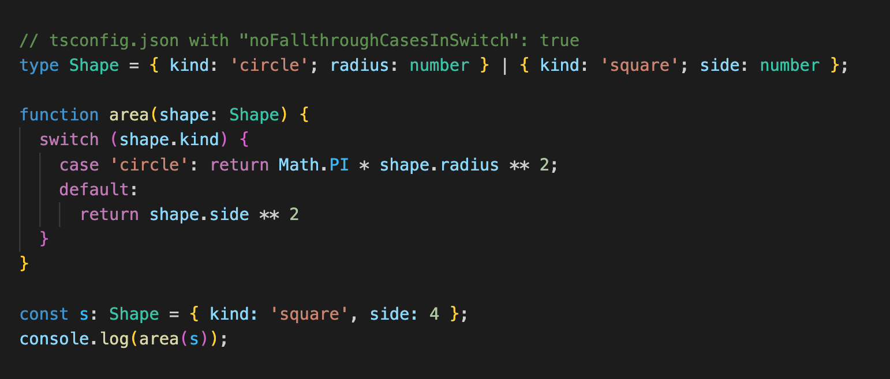

ReScript is like TypeScript except better. Some say that ReScript is what JavaScript would have been if it had more time in the oven. Its type system, which is the focus of this post, is much more complete than TypeScript's, making it a great choice as a Next Generation Web Development language. The goal of _**Next Gen Web Dev**_ is to make web apps more reliable and robust, making the process safer for developers, and the experience of the web more enjoyable. Here are 5 problematic areas in TypeScript's type system that are fixed in ReScript.

### Unsafe Array Access

In TypeScript, you can unsafely access array elements and receive `undefined`, even with strict settings enabled. This happens because TypeScript's goal is to be a _static_ overlay on JavaScript for compatibility reasons. Consequently, dynamic array access and its inherent safety risks cannot be prevented at compile time.

In ReScript, it's not possible to access elements of arrays unsafely, no matter the particular syntax you use. Here is an example of accessing elements in an array in ReScript, in two different ways.

No matter which way you choose, you are always protected with the `option` type, which forces the developer to code all cases.

### Null Safety

TypeScript improves upon JavaScript's lack of null safety; you must acknowledge a type is nullable through a typed union. For example, when accessing the DOM, the element might be `null`.

Do you know what's better than handling `null`s? Not having `null`s at all—which is the case with ReScript, which eliminates an entire class of bugs. In ReScript, if we want to handle the presence or absence of something, we use the `option` type.

### Implicit Conversion

TypeScript makes implicit conversion harder to do, but it's still possible to stumble into it. Below is an example where unexpected type coercion can cause runtime errors:

ReScript does not allow implicit conversion at all. You must explicitly convert from one type to another, if it is allowable. This eliminates an entire category of runtime surprises that plague JavaScript and can still occur in TypeScript.

### Duck Typing

In TypeScript, there is no nominal distinction between types. This means that if objects have the same shape, they are treated as the same type. This can lead to semantic errors. Here is an example where a debt could be mistaken for an account balance.

In ReScript, type compatibility is based on explicit type names or declarations rather than structural shape. This means you can create distinct types that prevent semantic confusion, even if they have identical structures. The compiler enforces these distinctions, catching errors that would slip through TypeScript's structural typing system.

### Exhaustiveness Checking

In TypeScript, you can achieve exhaustiveness checking if you have the right settings enabled, and if you code the switch statement correctly. It involves using the `never` keyword.

In ReScript, there is true exhaustiveness checking built into the language. The compiler needs no additional input from the developer to understand that all cases must be covered. If you add a new variant to a union type, the compiler will immediately flag every pattern match that doesn't handle the new case.

### The Next Generation Web Development Choice

These five examples highlight a fundamental difference in philosophy. TypeScript aims to add static typing to JavaScript while maintaining compatibility and familiar syntax. ReScript, on the other hand, prioritizes correctness and safety above all else.

For **Next Gen Web Development**, this distinction is crucial. We're not just looking for better tooling—we're looking for languages that eliminate entire classes of bugs before they reach production. ReScript delivers on this promise:

- **Zero runtime exceptions** from null/undefined access
- **Guaranteed array bounds safety**
- **Complete exhaustiveness checking** without developer intervention
- **Semantic type safety** that prevents business logic errors
- **Explicit conversions** that eliminate surprise type coercion

While TypeScript represents an improvement over plain JavaScript, ReScript represents the future: a language designed from the ground up for reliability, safety, and developer confidence. For teams serious about building robust web applications, ReScript offers the type safety guarantees that TypeScript simply cannot provide.

The choice is clear: continue managing JavaScript's chaos with increasingly complex tooling, or embrace a language that eliminates the chaos entirely. That's the Next Gen Web Development difference.
