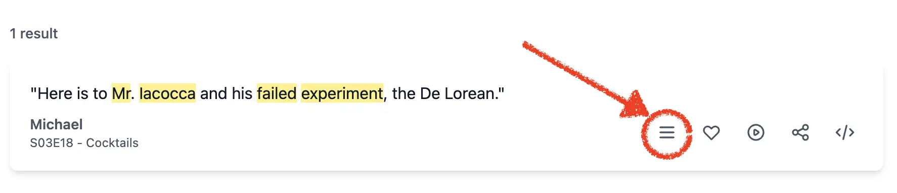

I run [The Office Lines](https://theofficelines.com), a site where fans can search every line of dialog from The Office (US) and deep-dive on scenes to explore the surrounding context. While I was able to make some positive correlations between the dialog and the scene on YouTube, I wasn't satisfied as a user. What I needed was a curator, and I chose AI as mine.

This problem of video curation has a similar shape and solution to that with [topic classification & AI](/blogs/using-ai-to-automate-quality-content-delivery/). Topic classification involved feeding an entire episode of dialog into AI and having it evaluate individual lines in context, making a judgment on how well a topic applied to each line with a confidence score. The prompt engineering involved providing a list of topics, their definitions, guidance on how to score, and details on how to return structured data.

The process of video curation was very similar. I was able to add AI into my workflow on both ends; to formulate a proper query and to evaluate the YouTube results. In the first prompt, we fed in the line and 10 preceding/following lines of dialog for context. The goal was to get Claude to craft a query that would result in high-quality results from the YouTube API. Our simple YouTube API search sat between the two prompts. Lastly, the second prompt was given the same block of dialog, but a different role as curator of the results. Its job was to examine the results and identify the best match with a confidence score, returning structured data that we could parse and store in our index.

<blockquote data-office-quote
  data-line="Here is to Mr. Iacocca and his failed experiment, the De Lorean."
  data-character="Michael"
  data-season="03" data-episode="18"
  data-title="Cocktails">
  "Here is to Mr. Iacocca and his failed experiment, the De Lorean." — Michael
</blockquote>

### Result
As a user of the site myself, I'm genuinely excited when I find a quote I'm curious about and can watch the scene on YouTube. Even the most obscure, yet interacted-with lines seem sufficient for AI to correlate the input with the correct scene from The Office (US) official channel. I encourage you to do a deep-dive and <a href="https://theofficelines.com/?q=03_18_160" target="_blank">judge for yourself</a> whether the match is correct.

