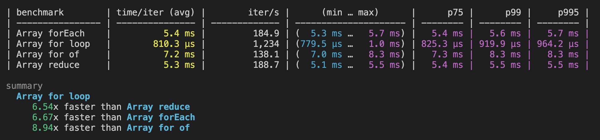
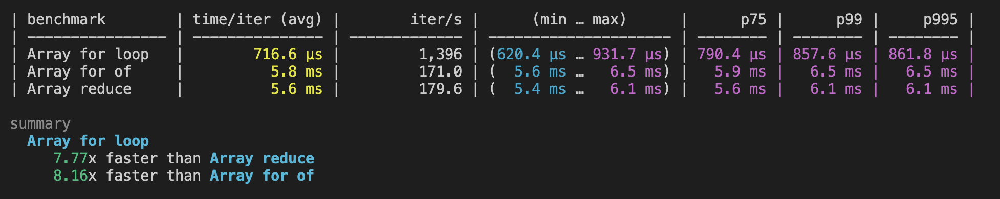
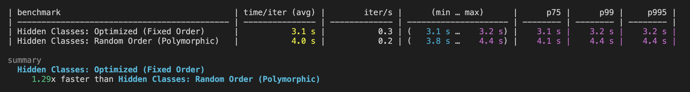
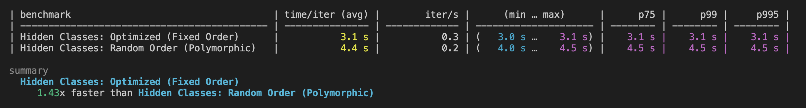

ReScript makes a bold claim about performance optimization:

> "[The] type system and compiler naturally guide you toward writing code that's very often performant by default"
>
> — [ReScript Documentation](https://rescript-lang.org/docs/manual/v11.0.0/introduction)

This is elborated upon in the next paragraph

> "ReScript gives you a real one [type system] and generates code that's friendly to optimizations by default."
>
> — [ReScript Documentation](https://rescript-lang.org/docs/manual/v11.0.0/introduction)

These statements sound impressive, but they're surprisingly vague. What exactly does "friendly to optimizations by default" mean? Does ReScript automatically rewrite your code to use the fastest JavaScript patterns? Does it somehow magically avoid common performance pitfalls?

As someone committed to **Next-Gen Web Development**, I believe in evidence-based decision making. Marketing claims need to be backed by measurable results. So I decided to put ReScript's optimization promises to the test with real benchmarks.

### The Setup

Borrowing from [JavaScript performance is weird... Write scientifically faster code with benchmarking](https://www.youtube.com/watch?v=_pWA4rbzvIg) and [this blog post](https://richardartoul.github.io/jekyll/update/2015/04/26/hidden-classes.html), I decided I would benchmark performance on array iteration and V8 optimizations on ReScript output to see if the performance was any different from handwritten JavaScript.

### Test 1: Array Iteration Performance

My first test focused on one of the most common performance bottlenecks in JavaScript: array iteration. If ReScript truly generates "optimization-friendly" code, surely it would choose the fastest iteration methods regardless of how I write the ReScript source.

Following the methodology from `Beyond Fireship`'s excellent video on JavaScript performance, I set up 4 different loops (`for`, `for of`, `forEach`, and `reduce`) and benchmarked them using Deno for one million iterations on an array of 1000 integers.

```js
export function sumForLoop(arr) {
  let sum = 0;
  const len = arr.length; // Cache length to avoid repeated property access
  for (let i = 0; i < len; i++) {
    sum += arr[i];
  }
  return sum;
}

export function sumForOf(arr) {
  let sum = 0;
  for (const num of arr) {
    sum += num;
  }
  return sum;
}

export function sumReduce(arr) {
  return arr.reduce((acc, val) => acc + val, 0);
}

export function sumForEach(arr) {
  let sum = 0;
  arr.forEach((val) => (sum += val));
  return sum;
}
```

As expected, the handwritten JavaScript results confirmed what we know about V8 optimization: traditional `for` loops dominate, `for...of` follows closely, while `forEach` and `reduce` lag significantly behind due to function call overhead.



**Now for the crucial test**: Would ReScript's compiler automatically optimize my iteration style to generate fast JavaScript, regardless of how I wrote the ReScript source?

I translated the same algorithms to ReScript (excluding `for...of` since ReScript doesn't have that syntax):

```js
let sumForLoop = (arr: array<int>) => {
  let sum = ref(0)
  let len = Array.length(arr)  // Cache length to avoid repeated property access
  for i in 0 to len - 1 {
    sum := sum.contents + switch arr[i] {
    | Some(n) => n
    | None => 0
    }
  }
  sum.contents
}

let sumForOf = (arr: array<int>) => {
  let sum = ref(0)
  Array.forEach(arr, num => sum := sum.contents + num)
  sum.contents
}

let sumReduce = (arr: array<int>) => {
  Array.reduce(arr, 0, (acc, val) => acc + val)
}

```

**The results were disappointing but not surprising:**



ReScript's performance mirrored the JavaScript patterns exactly. The `for` loop was fastest, while `Array.reduce` lagged behind significantly. **ReScript didn't automatically optimize anything**.

I had suspected this would be the case after examining the generated JavaScript output. Rather than converting everything to optimized `for` loops, ReScript maintains a fairly direct translation of your source code patterns:

```js
// Generated by ReScript, PLEASE EDIT WITH CARE

import * as Core__Array from "@rescript/core/src/Core__Array.res.mjs";

function sumForLoop(arr) {
  var sum = 0;
  var len = arr.length;
  for (var i = 0; i < len; ++i) {
    var n = arr[i];
    sum = (sum + (n !== undefined ? n : 0)) | 0;
  }
  return sum;
}

function sumForOf(arr) {
  var sum = {
    contents: 0,
  };
  arr.forEach(function (num) {
    sum.contents = (sum.contents + num) | 0;
  });
  return sum.contents;
}

function sumReduce(arr) {
  return Core__Array.reduce(arr, 0, function (acc, val) {
    return (acc + val) | 0;
  });
}

export { sumForLoop, sumForOf, sumReduce };
/* No side effect */
```

**Clearly, ReScript wasn't doing algorithmic optimizations.** Maybe the "optimization-friendly" claims referred to something more subtle?

The documentation mentions specific V8 optimization techniques:

> "hidden classes, inline caching, avoiding deopts, etc"
>
> — [ReScript Documentation](https://rescript-lang.org/docs/manual/v11.0.0/introduction)

This seemed more promising. Perhaps ReScript generates JavaScript that better leverages V8's internal optimization strategies.

### Test 2: V8 Engine Optimizations

V8's optimization engine is incredibly sophisticated, but it relies on predictable code patterns. The most critical optimizations involve:

If you would like to understand hidden classes and inline caching, I suggest reading [this article](https://richardartoul.github.io/jekyll/update/2015/04/26/hidden-classes.html) by _Richard Artoul_. For the sake of this article, I simply want to establish that the V8 engine performs specific optimizations based on how object properties are created and accessed—maintaining consistent property ordering and avoiding dynamic property additions can significantly improve performance through hidden class stability and inline caching.

**The Test Design:**

To isolate these optimizations, I created two scenarios:

1. **Optimal case**: Objects always get properties added in the same order (maintains hidden class consistency)
2. **Suboptimal case**: Properties are added in random order (breaks hidden class optimization)

If ReScript truly generates "optimization-friendly" code, it should somehow avoid the performance penalty of the suboptimal case.

```js
function Point(x, y) {
  this.x = x;
  this.y = y;
}

function createPoints(numObjects) {
  const points = [];
  for (let i = 0; i < numObjects; i++) {
    points.push(new Point(i % 100, (i + 1) % 100));
  }
  return points;
}

function addPropsFixed(points, numObjects) {
  for (let i = 0; i < numObjects; i++) {
    const obj = points[i];
    obj.a = i % 10; // Fixed: a then b
    obj.b = (i + 5) % 10;
  }
}

function addPropsRandom(points, numObjects) {
  for (let i = 0; i < numObjects; i++) {
    const obj = points[i];
    if (Math.random() > 0.5) {
      obj.a = i % 10; // Random order
      obj.b = (i + 5) % 10;
    } else {
      obj.b = (i + 5) % 10;
      obj.a = i % 10;
    }
  }
}

function hotAccess(points, numObjects, iters) {
  let total = 0;
  for (let iter = 0; iter < iters; iter++) {
    for (let i = 0; i < numObjects; i++) {
      total += points[i].a + points[i].b;
    }
  }
  return total;
}
```

The `addPropsFixed` method adds properties in a consistent order, while `addPropsRandom` randomizes the order—a pattern that should destroy V8's hidden class optimization.

**JavaScript baseline results** (10,000 objects accessed 100,000 times each):



Perfect! The results show exactly what we'd expect: consistent property ordering is dramatically faster. V8's hidden class optimization is working as designed.

**Now the critical question**: Would ReScript somehow generate more optimization-friendly JavaScript, even when I write potentially suboptimal ReScript patterns?

```js
type point = {x: int, y: int}

let createPoints = numObjects => {
  let points: array<point> = []
  for i in 0 to numObjects - 1 {
    let point = {x: mod(i,100), y: mod((i + 1), 100)}
    Belt.Array.push(points, point)
  }
  points
}

let addPropsFixed = (points, numObjects) => {
  for i in 0 to numObjects - 1 {
    let obj = Belt.Array.getExn(points, i)
    obj["a"] #= mod(i,10)  // Fixed: a then b
    obj["b"] #= mod((i + 5),10)
  }
}

let addPropsRandom = (points, numObjects) => {
  for i in 0 to numObjects - 1 {
    let obj = Belt.Array.getExn(points, i)
    if Js.Math.random() > 0.5 {
      obj["a"] #= mod(i, 10)  // Random order
      obj["b"] #= mod((i + 5), 10)
    } else {
      obj["b"] #= mod((i + 5), 10)
      obj["a"] #= mod(i, 10)
    }
  }
}

let hotAccess = (points, numObjects, iters) => {
  let total = ref(0)
  for _ in 0 to iters - 1 {
    for i in 0 to numObjects - 1 {
      let obj = Belt.Array.getExn(points, i)
      total := total.contents + obj["a"] + obj["b"]
    }
  }
  total.contents
}
```

**The results tell the story:**



ReScript's performance mirrors JavaScript exactly—no magical optimization here either. The fixed-order version is fast, the random-order version is slow. **ReScript doesn't solve V8 optimization challenges for you.**

Looking at the generated JavaScript confirms this:

```js
// Generated by ReScript, PLEASE EDIT WITH CARE

import * as Belt_Array from "rescript/lib/es6/belt_Array.js";

function createPoints(numObjects) {
  var points = [];
  for (var i = 0; i < numObjects; ++i) {
    var point_x = i % 100;
    var point_y = ((i + 1) | 0) % 100;
    var point = {
      x: point_x,
      y: point_y,
    };
    points.push(point);
  }
  return points;
}

function addPropsFixed(points, numObjects) {
  for (var i = 0; i < numObjects; ++i) {
    var obj = Belt_Array.getExn(points, i);
    obj.a = i % 10;
    obj.b = ((i + 5) | 0) % 10;
  }
}

function addPropsRandom(points, numObjects) {
  for (var i = 0; i < numObjects; ++i) {
    var obj = Belt_Array.getExn(points, i);
    if (Math.random() > 0.5) {
      obj.a = i % 10;
      obj.b = ((i + 5) | 0) % 10;
    } else {
      obj.b = ((i + 5) | 0) % 10;
      obj.a = i % 10;
    }
  }
}

function hotAccess(points, numObjects, iters) {
  var total = 0;
  for (var _for = 0; _for < iters; ++_for) {
    for (var i = 0; i < numObjects; ++i) {
      var obj = Belt_Array.getExn(points, i);
      total = (((total + obj.a) | 0) + obj.b) | 0;
    }
  }
  return total;
}

export { createPoints, addPropsFixed, addPropsRandom, hotAccess };
/* No side effect */
```

The generated code is essentially identical to handwritten JavaScript. ReScript isn't reordering property assignments or converting to more optimization-friendly patterns.

### The Reality Behind the Claims

After seeing these results, I revisited the ReScript documentation more carefully. Buried deeper in the introduction, there's a more honest explanation:

> "A widespread adage to write fast JavaScript code is to write as if there's a type system (in order to trigger JS engines' good optimization heuristics). ReScript gives you a real one and generates code that's friendly to optimizations by default."
>
> — [ReScript Documentation](https://rescript-lang.org/docs/manual/v11.0.0/introduction)

**Ah, there it is.** The "optimization-friendly" claim isn't about the compiler generating faster code—it's about the type system encouraging patterns that happen to work well with JavaScript engines.

### What ReScript Actually Provides

Let me be clear: **ReScript isn't generating magically optimized JavaScript.** The performance benefits, when they exist, come from ReScript's type system nudging you toward predictable, monomorphic code patterns that V8 optimizes well. When you're forced to be explicit about types, you're less likely to write the kind of shape-shifting code that breaks V8's assumptions.

### The Next-Gen Web Development Perspective

As advocates for **Next-Gen Web Development**, we need to be honest about our tools' capabilities. ReScript offers significant benefits:

- **Type safety** eliminates entire classes of runtime errors
- **Functional programming** paradigms lead to more predictable code
- **Excellent interop** with existing JavaScript ecosystems
- **Mature tooling** with solid IDE support

But performance optimization isn't automatically one of them. **You still need to understand JavaScript performance principles.** You still need to:

- Choose appropriate algorithms and data structures
- Understand V8 optimization patterns
- Profile and benchmark your critical paths
- Make conscious performance trade-offs

### The Verdict

ReScript's optimization claims are **technically true but misleading**. The type system does encourage some patterns that work well with JavaScript engines, but it's not doing the performance work for you.

**For Next-Gen Web Development, this is actually good news.** We don't want tools that hide performance complexity behind magical optimizations—we want tools that help us write better code while still giving us control over performance-critical decisions.

ReScript delivers on its primary promise: **type safety and functional programming for JavaScript.** The performance benefits, when they occur, are a pleasant side effect of good software engineering practices, not compiler magic.

If you're choosing ReScript, choose it for type safety, not performance optimization. And remember: **there's no substitute for understanding the platform you're targeting.** Even with the best tools, JavaScript performance expertise remains essential for building truly fast web applications.

---

[Sign up to my newsletter](https://nathantranquilla.kit.com/0d8a3f84b7) to get more Next-Gen Web Dev insights!
